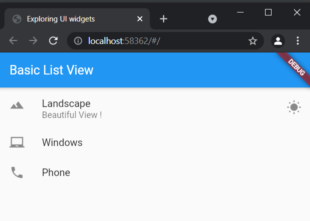

##  How to create List in Flutter?

Steps:
- Just update the code in `main.dart` file. 
### Code:

* main
```dart
import 'package:flutter/material.dart';
import './app_screens/home.dart';

void main() {
  runApp(MaterialApp(
    title: "Exploring UI widgets",
    home: Scaffold(
      appBar: AppBar(title: Text("Basic List View"),),
      body: getListView(),
    ),
  ));
}

Widget getListView() {

  var listView = ListView(
    children: <Widget>[

      ListTile(
        leading: Icon(Icons.landscape),
        title: Text("Landscape"),
        subtitle: Text("Beautiful View !"),
        trailing: Icon(Icons.wb_sunny),
        onTap: () {
          debugPrint("Landscape tapped");
        },
      ),

      ListTile(
        leading: Icon(Icons.laptop_chromebook),
        title: Text("Windows"),
      ),

      ListTile(
        leading: Icon(Icons.phone),
        title: Text("Phone"),
      ),

//      Text("Yet another element in List"),

//      Container(color: Colors.red, height: 50.0,)

    ],
  );

  return listView;
}
```
<p>&nbsp;</p>


<p>&nbsp;</p>

### Output:

