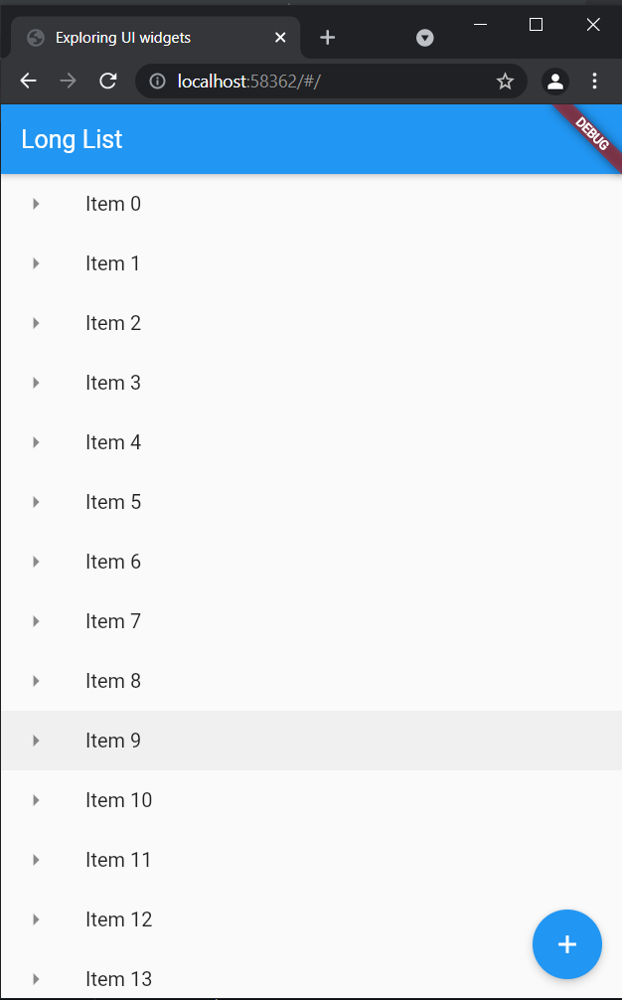
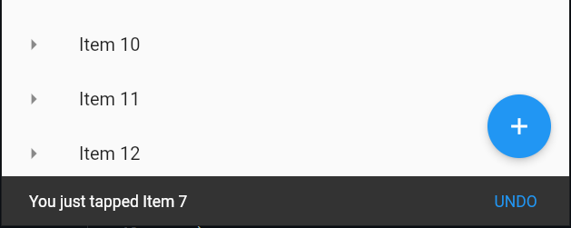

##  Flutter Floating Action Button and Snack Bar

## Steps:
- Just update the code in `main.dart` file.
### Code:

* main
```dart
import 'package:flutter/material.dart';
import './app_screens/home.dart';

void main() {
  runApp(MaterialApp(

    title: "Exploring UI widgets",

    home: Scaffold(
        appBar: AppBar(title: Text("Long List"),),
        body: getListView()
    ),

  ));
}

List<String> getListElements() {

  var items = List<String>.generate(1000, (counter) => "Item $counter");
  return items;
}

Widget getListView() {

  var listItems = getListElements();

  var listView = ListView.builder(
      itemBuilder: (context, index) {

        return ListTile(
          leading: Icon(Icons.arrow_right),
          title: Text(listItems[index]),
          onTap: () {
            debugPrint('${listItems[index]} was tapped');
          },
        );
      }
  );

  return listView;
}
```
<p>&nbsp;</p>


<p>&nbsp;</p>

### Output:
| Floating Action Button  | Snack Bar |
| :-------------: | :-------------: |
|   |   |
