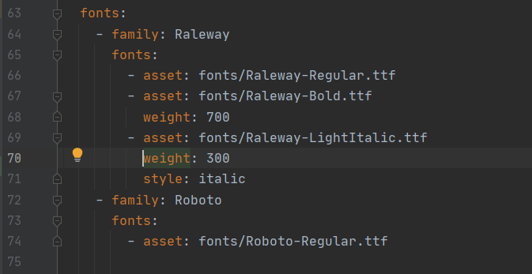

## Flutter Custom Fonts in Text widget. Text Style in Flutter.

## Using of Custom Fonts:
1. Download anf Import Font File
   * Head to `fonts.google.com` 
   * Download a font family (in my case i downloaded `Raleway`)
   * Extract the Zip file and select copy some fonts like,
     * Raleway-Bold
     * Raleway-LightItalic
     * Raleway-Regular
   * Now create a new directory by the name <b>`fonts`</b> in your project and paste the above files in it.
2. Declare it in `pubspec.yaml`
   * <b>`pubspec.yaml`</b> - File containing information about project dependencies and metadata.
   * Open `pubspec.yaml` and head to line starting with `#fonts` and select lines till `#weight` and use shortcut key <b>`WIN+CTRL+/`</b>
   * Give the path correctly as shown below
   * 
4. Use it in text widget

### Code:

* main
```dart
import 'package:flutter/material.dart';
import './app_screens/home.dart';

void main() {
  runApp(MaterialApp(
    title: "Exploring UI widgets",
    home: Home(),
  ));
}
```
<p>&nbsp;</p>

* home
```dart
import 'package:flutter/material.dart';


class Home extends StatelessWidget {

  @override
  Widget build(BuildContext context) {

    return Center(
        child: Container(
          alignment: Alignment.center,
          color: Colors.deepPurple,
          child: Text(
            "Flight",
            textDirection: TextDirection.ltr,
            style: TextStyle(
                decoration: TextDecoration.none,
                fontSize: 75.0,
                fontFamily: 'Raleway',
                fontWeight: FontWeight.w700,
                color: Colors.white
            ),
          ),
        )
    );
  }
}
```
<p>&nbsp;</p>

### Output:

