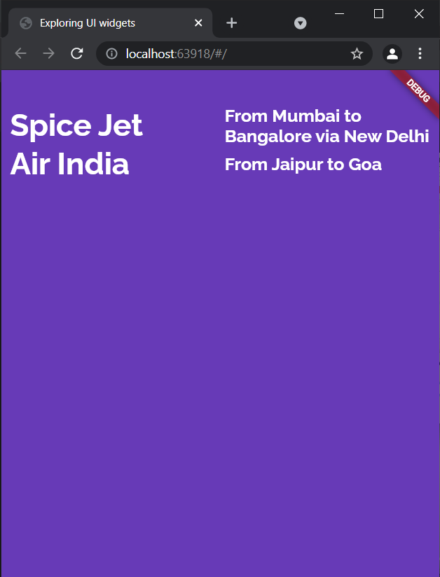

## Flutter Row, Column and Expanded widget

### Code:

* main
```dart
import 'package:flutter/material.dart';
import './app_screens/home.dart';

void main() {
  runApp(MaterialApp(
    title: "Exploring UI widgets",
    home: Home(),
  ));
}
```
<p>&nbsp;</p>

* home
```dart
import 'package:flutter/material.dart';

class Home extends StatelessWidget {
  @override
  Widget build(BuildContext context) {
    return Center(
        child: Container(
            padding: EdgeInsets.only(left: 10.0, top: 40.0),
            alignment: Alignment.center,
            color: Colors.deepPurple,
            child: Column(
              children: <Widget>[
                Row(
                  children: <Widget>[
                    Expanded(
                        child: Text(
                          "Spice Jet",
                          textDirection: TextDirection.ltr,
                          style: TextStyle(
                              decoration: TextDecoration.none,
                              fontSize: 35.0,
                              fontFamily: 'Raleway',
                              fontWeight: FontWeight.w700,
                              color: Colors.white),
                        )),
                    Expanded(
                        child: Text(
                          "From Mumbai to Bangalore via New Delhi",
                          textDirection: TextDirection.ltr,
                          style: TextStyle(
                              decoration: TextDecoration.none,
                              fontSize: 20.0,
                              fontFamily: 'Raleway',
                              fontWeight: FontWeight.w700,
                              color: Colors.white),
                        )),
                  ],
                ),
                Row(
                  children: <Widget>[
                    Expanded(
                        child: Text(
                          "Air India",
                          textDirection: TextDirection.ltr,
                          style: TextStyle(
                              decoration: TextDecoration.none,
                              fontSize: 35.0,
                              fontFamily: 'Raleway',
                              fontWeight: FontWeight.w700,
                              color: Colors.white),
                        )),
                    Expanded(
                        child: Text(
                          "From Jaipur to Goa",
                          textDirection: TextDirection.ltr,
                          style: TextStyle(
                              decoration: TextDecoration.none,
                              fontSize: 20.0,
                              fontFamily: 'Raleway',
                              fontWeight: FontWeight.w700,
                              color: Colors.white),
                        )),
                  ],
                )
              ],
            )));
  }
}
```
<p>&nbsp;</p>

### Output:

